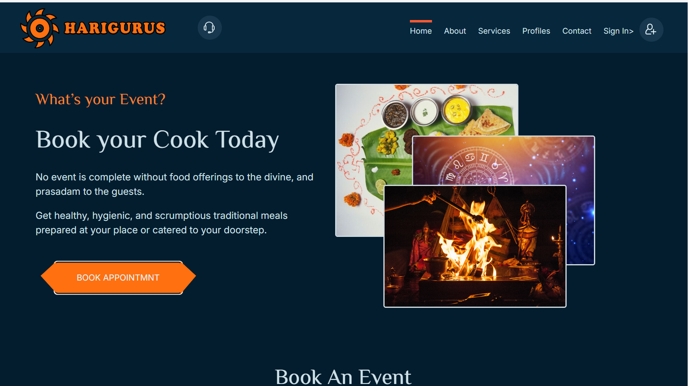
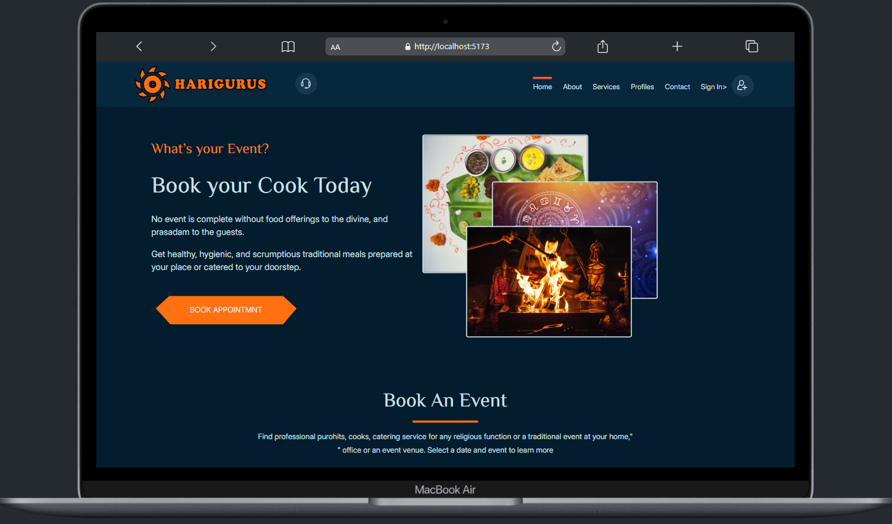
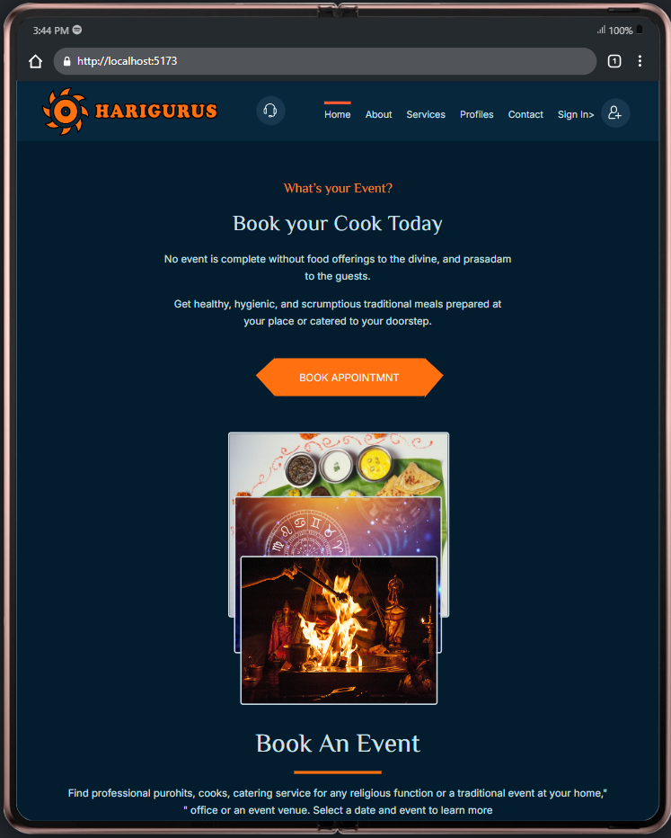
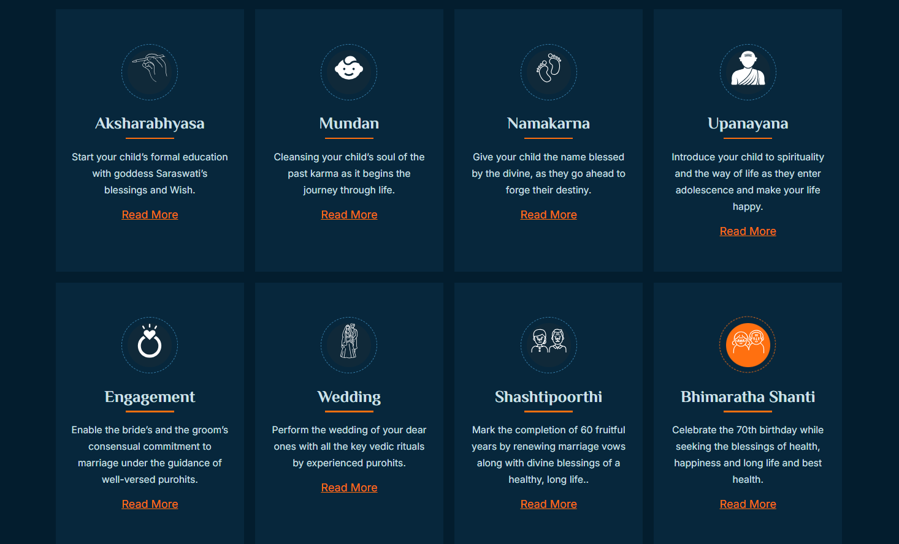
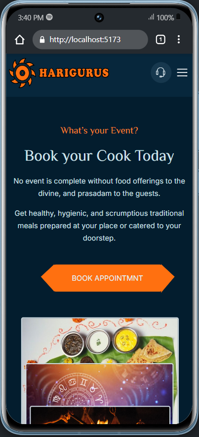
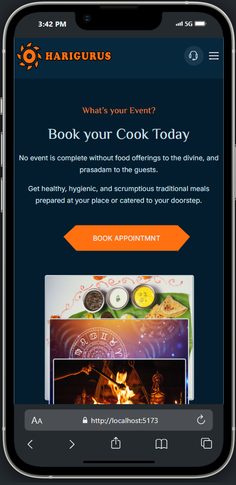
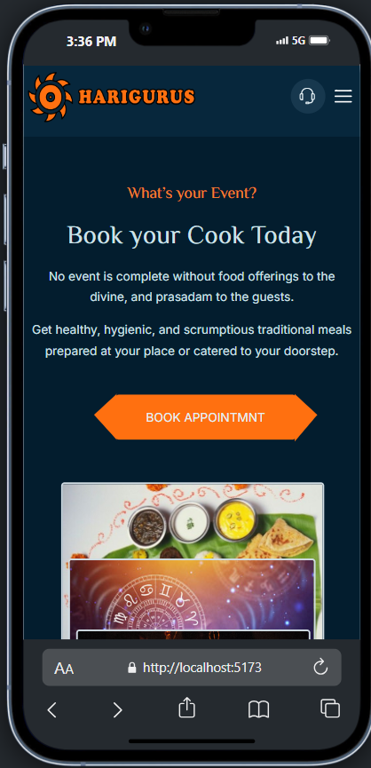
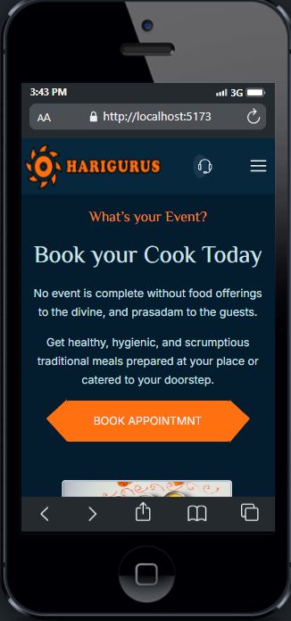
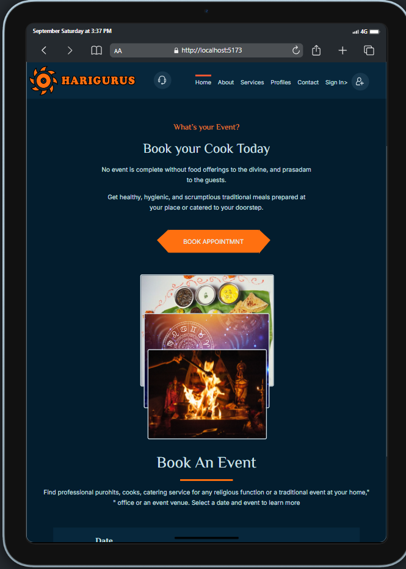

# 🌟 Harigurus - Puja Path Website

Welcome to **Harigurus** – your one-stop platform to book events and services like **Purohithya**, **Astrology**, **Cooking**, and various **Pujas**. The highlight of this project is that it uses **React Js** , **pure CSS** , **react-router-dom** , **react-helmet** , **react-select**  for styling, showcasing the capabilities of CSS without any external libraries. Icons are used extensively to make the interface more engaging.




## 🌟 Key Features

1. **Scroll to Top**: The website automatically scrolls to the top when the route changes, providing a seamless user experience.
2. **Event & Service Booking**: Users can easily book a variety of services, such as Purohithya, Astrology consultations, and Cooking services.
3. **Service Registration**: Allows service providers to register their events.
4. **SEO Optimization**: Utilizes React Helmet to dynamically change the page titles and meta descriptions, which helps improve the website's SEO.




## 📚 Packages Used

### 1. **React Router DOM** 📍
   - **Purpose**: Handles the routing within the application, allowing for a single-page app experience.
   - **Key Features**:
     - **Routing**: Manages navigation and allows for nested routing in the application.
   - **Why It's Important**: Facilitates smooth navigation, ensuring users can switch between pages without reloading the app.

### 2. **React Helmet** 🎩
   - **Purpose**: Modifies the `<head>` section of the HTML in a React application.
   - **Key Features**:
     - **Dynamic Titles**: Allows the dynamic changing of the page title based on the content, which is crucial for SEO.
     - **Meta Tags**: Updates meta tags for improved search engine indexing.
   - **Impact on App**: If React Helmet is removed, the rest of the app's functionality remains unaffected. However, dynamic title and meta updates will not occur, potentially affecting SEO.

### 3. **Font Awesome SVG Icons** 🎨
   - **Purpose**: Provides a rich set of icons to enhance the user interface.
   - **Why Used**: Adding icons helps to visually represent actions and sections, making the interface more intuitive.
   - **Usage**: Icons are scattered throughout the website to represent services, navigation links, and actions, enhancing user interaction.

### 4. **React Select** 🎛️
   - **Purpose**: A customizable select/dropdown component for React.
   - **Why Used**: To create elegant and accessible dropdowns for selecting services or event types.
   - **Customization**: Provides flexibility in styling and behavior, which integrates well with the pure CSS used in the project.




### 5. **Vite** ⚡
   - **Purpose**: A fast development tool for building React applications.
   - **Why Used**: Enhances the development process with rapid hot-module replacement and quick rebuilds, speeding up productivity.



## 🌠 Services and Events

### 📜 Services
- **Purohithya**
- **Astrology**
- **Cooking**
- **Pujas**

### 🕉️ Pujas
- Satyanarayana Puja
- Lakshmi Puja
- Office Puja

### 🛕 Purohithya Events
- Aksharabhyasa
- Mundan
- Namakaran
- Upanayana
- Engagement
- Wedding
- Bhimaratha Shanti
- Gruhapravesha
- Pitru Paksha
- Shraddha
- Uttara Kriya Karma

### 🔮 Astrology
- Online Consultation
- Book & Visit
- Q & A

### 🍲 Cooking Services
- In-House Cooking
- Catering



## 🌐 SEO (Search Engine Optimization) Using React Helmet

React Helmet is used to dynamically change the document title and meta tags based on the content. This enhances the website's SEO, ensuring better visibility in search engine results.





### ⚠️ Important Note
If **React Helmet** is removed, the website will still work, but dynamic changes to the `<head>` section (title, meta description) will no longer function. This will impact SEO but not the core application’s performance.





### ✨ Conclusion
The **Harigurus** website is a comprehensive event-booking platform built using **React** and pure **CSS**. Key functionalities include:
- Routing with **React Router DOM**.
- SEO enhancements with **React Helmet**.
- A visually appealing interface using **Font Awesome** icons.





The use of pure CSS highlights the power of CSS in creating modern, responsive web designs without relying on external libraries.

With a focus on simplicity and efficiency, this website aims to provide a seamless experience for booking spiritual events and services.





### 🛑 Disclaimer
This project was developed using only pure **CSS** for styling. External libraries like **Font Awesome** and **React Select** were used solely for enhancing icons and dropdowns.


## 🛠️ Instructions for Using the Website
1. **Clone the Repository**:
   ```bash
   git clone(https://github.com/sahilTiwariiii/Harigurus-Project)


## 🛠️ How to Install and Run the Project

Follow these steps to set up and run the project locally:

### Prerequisites
- Ensure you have **Node.js** and **npm** (Node Package Manager) installed on your system.

### 🚀 Installation
1. **Clone the repository:**
    ```bash
    git clone(https://github.com/sahilTiwariiii/Harigurus-Project)
    ```
   
2. **Navigate to the project directory:**
    ```bash
    cd harigurus
    ```

3. **Install the dependencies:**
    ```bash
    npm install
    ```

### 🏃 Running the Project
1. **Start the development server:**
    ```bash
    npm run dev
    ```
    This will start the application using **Vite**. You can now open your browser and go to:
    ```
    http://localhost:5173
    ```

### 📦 Building for Production
To build the project for production, run:
```bash

npm run build


## 🌐 Production Build

The **Harigurus** website is built and optimized for production using **Vite**. This process bundles the application for deployment, ensuring fast loading times and a smooth user experience.

### 🔗 Live Demo
You can access the live version of the website here:
[🌐 Harigurus Website](https://https://www.harigurus.com/)

### 🛠️ Building for Production
To build the application for production, run the following command:
```bash
# Development Phase
[🌐 Harigurus Website](https://https://www.https://harigurusw.netlify.app/)